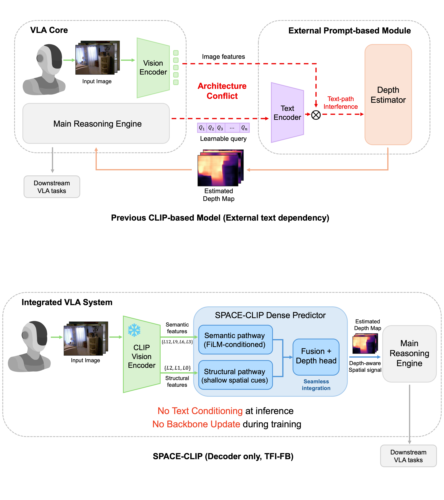
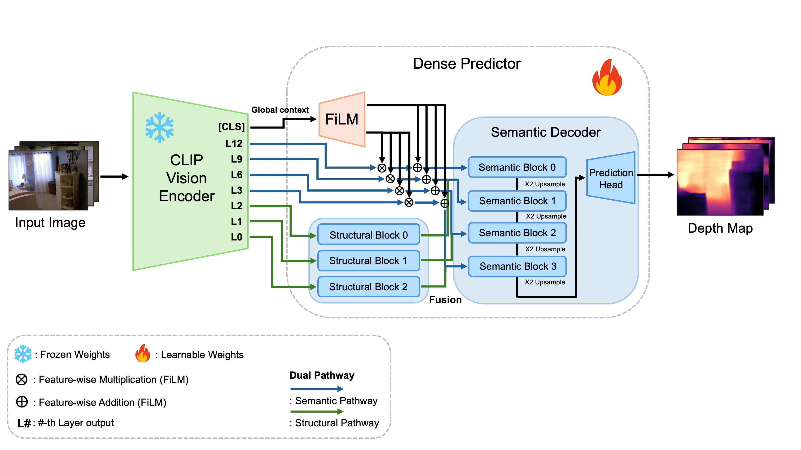
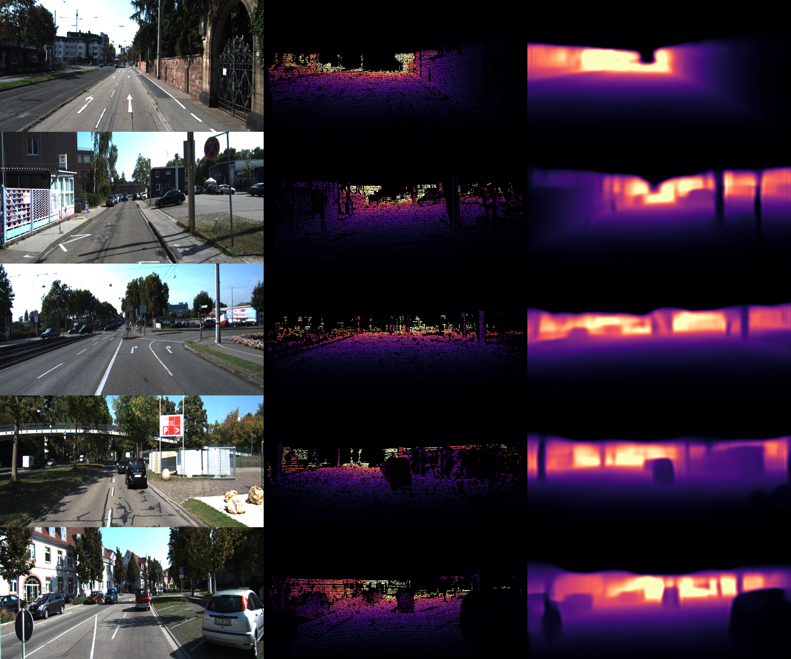

# SPACE-CLIP

SPACE-CLIP is a monocular depth estimation framework that decodes depth from a **frozen CLIP vision encoder** using a lightweight dual-pathway decoder.

- No text encoder at inference time
- Frozen CLIP vision backbone
- Decoder-only adaptation for dense prediction

## Highlights

- KITTI (Eigen split): `AbsRel 0.0901`
- NYU Depth V2: `AbsRel 0.1042`
- Constraint setting: **TFI-FB** (text-free inference + frozen vision backbone)

## Method Summary

The dense predictor has two streams:
- **Semantic pathway**: deep CLIP features with FiLM conditioning from global context
- **Structural pathway**: shallow CLIP features for local geometric detail

Their features are fused hierarchically to recover high-resolution depth.

## Figures

### Concept


### Architecture


### KITTI qualitative


### NYU qualitative


## Installation

```bash
python -m venv .venv
source .venv/bin/activate
pip install -r requirements.txt
```

## Dataset Setup

Use the automated script:

```bash
bash scripts/setup_datasets.sh
```

The script downloads and organizes KITTI/NYU files under local dataset paths used by config files.
For custom dataset roots and expected directory layout, see `datasets/README.md`.

## Training

Run training with:

```bash
bash scripts/run_release_experiment.sh <config.yaml> <gpu_id>
```

Examples:

```bash
# KITTI
bash scripts/run_release_experiment.sh configs/kitti.yaml 0

# NYU
bash scripts/run_release_experiment.sh configs/nyu.yaml 0
```

## Evaluation

Evaluate a checkpoint directly:

```bash
python scripts/eval_spaceclip_checkpoint.py \
  --config configs/kitti.yaml \
  --checkpoint checkpoints/SPACE_CLIP_KITTI/best_checkpoint.pt
```

Evaluation protocol controls:

- `eval_crop`: `none` / `eigen` / `garg` (or `auto` via legacy booleans)
- `median_scaling_eval`: `false` by default in release configs
- CLI overrides are available:

```bash
python scripts/eval_spaceclip_checkpoint.py \
  --config configs/kitti.yaml \
  --checkpoint checkpoints/SPACE_CLIP_KITTI/best_checkpoint.pt \
  --crop eigen \
  --median-scaling false
```

## Reproducibility Notes

- Default CLIP input is resized to `224x224` (see `utils/dataloader.py`).
- Reported settings are now folded into:
  - `configs/kitti.yaml`
  - `configs/nyu.yaml`

## Repository Hygiene

This repository ignores local training artifacts by default:
- `checkpoints/`
- `runs/`
- `datasets/kitti_nyu/`
- `datasets/_downloads/`
- `SPACE-CLIP/` (local paper workspace)

So model weights, logs, and local dataset files are not uploaded unintentionally.

## Citation

```bibtex
@misc{cho2026spaceclipspatialperceptionadaptive,
  title={SPACE-CLIP: Spatial Perception via Adaptive CLIP Embeddings for Monocular Depth Estimation},
  author={Taewan Cho and Taeryang Kim and Andrew Jaeyong Choi},
  year={2026},
  eprint={2601.17657},
  archivePrefix={arXiv},
  primaryClass={cs.CV},
  url={https://arxiv.org/abs/2601.17657}
}
```
