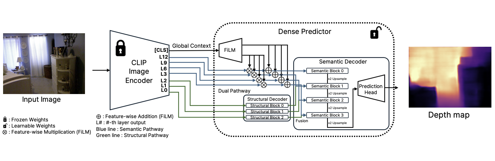
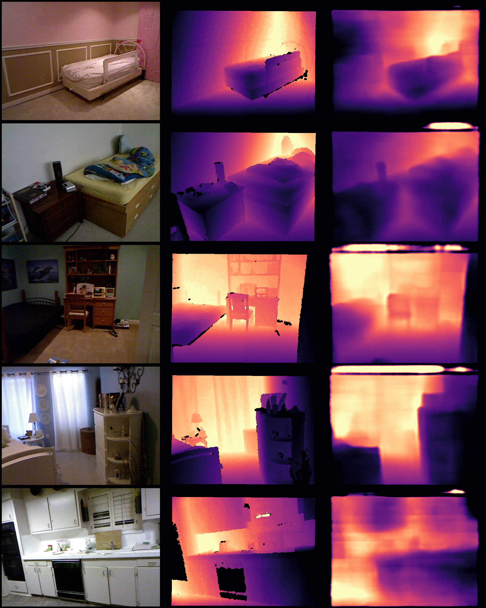
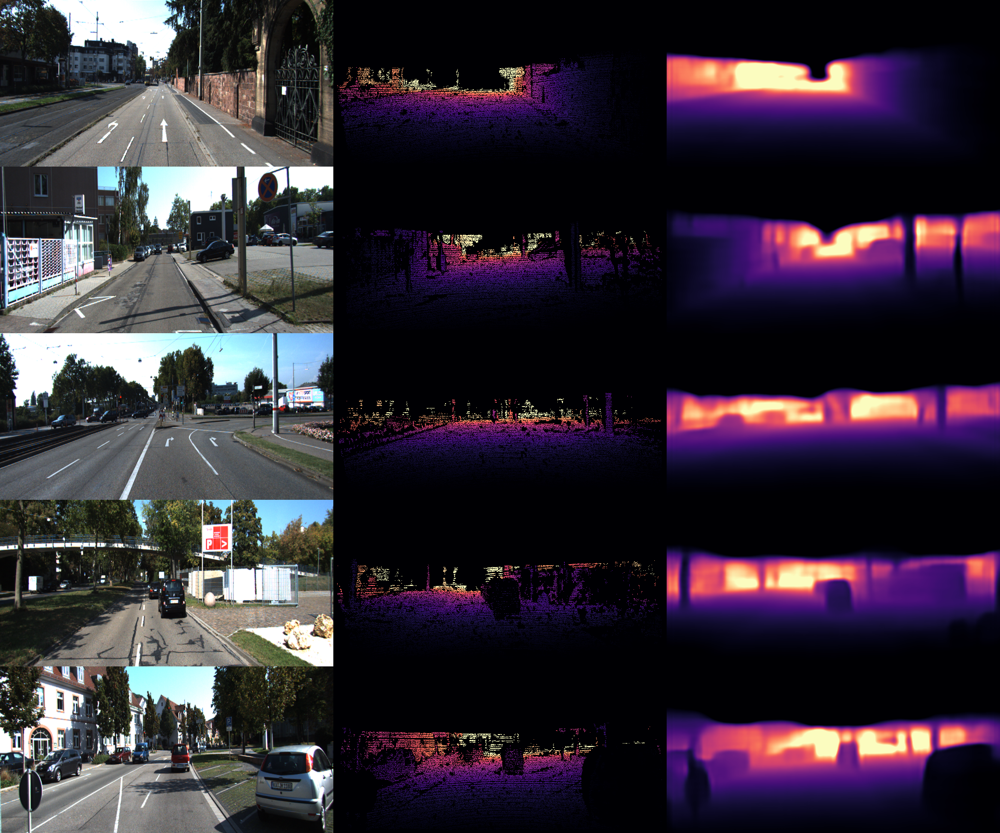
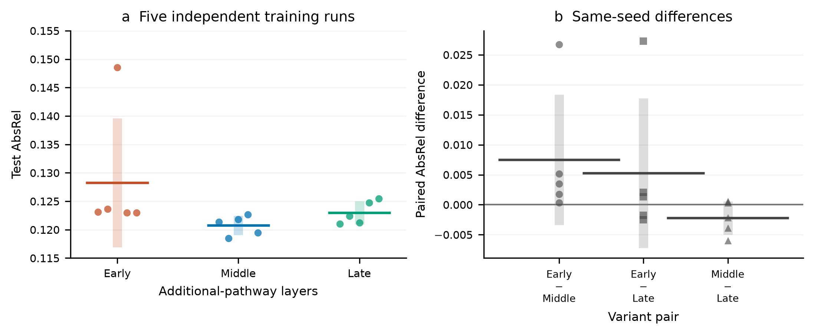
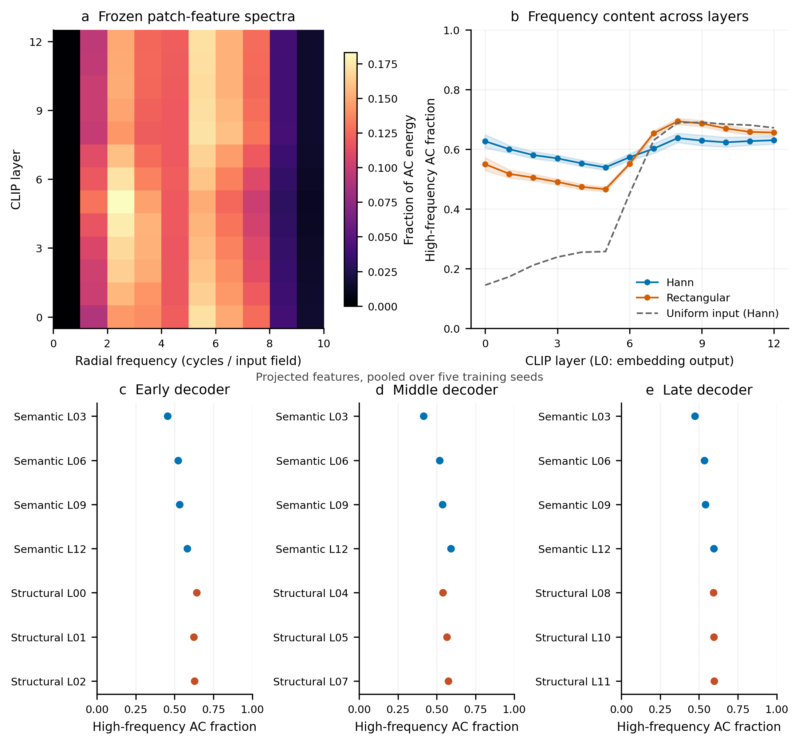
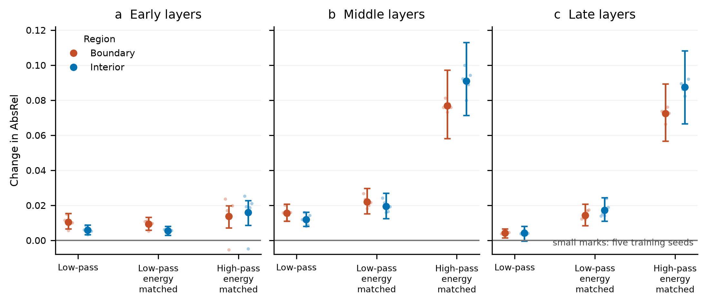

# SPACE-CLIP: Spatial Perception via Adaptive CLIP Embeddings for Monocular Depth Estimation

[Paper (arXiv)](https://arxiv.org/abs/2601.17657) · [Method](docs/method.md) · [Reproduction guide](docs/reproducibility.md) · [Controlled measurements](results/nyu_component_ablation)

SPACE-CLIP adds monocular depth prediction to a **frozen CLIP vision encoder** through a trainable dual-pathway decoder. It combines global image context with intermediate patch features and uses no text encoder at inference. The design targets reuse of a compatible visual backbone in an existing perception system, with all depth-specific learning confined to the decoder.

This repository accompanies the **v1** paper. It includes indoor and outdoor depth configurations, the completed controlled NYU component and layer-selection studies, and Fourier analyses of the decoder's inputs. The successor v2 study is maintained separately.

## Dual-pathway depth decoder

- **Semantic pathway:** CLIP states `[12, 9, 6, 3]` are conditioned with FiLM using the final pooled image representation.
- **Structural pathway:** a separate set of patch features enters spatial refinement without FiLM; the default configuration uses `[2, 1, 0]`.
- **Hierarchical fusion:** the decoder combines both streams during progressive upsampling and predicts a dense depth map.



Semantic and Structural name the processing roles of the two pathways. Their input features need not contain mutually exclusive kinds of information. The controlled study also evaluates middle and late Structural inputs with the same decoder architecture. See the [method and configuration guide](docs/method.md) for the implementation mapping and the scope of each experiment.

Shared encoding requires compatible backbone weights, preprocessing, and access to intermediate features. It is an integration use case; downstream robotic or VLA control performance is not evaluated here.

## Indoor and outdoor evaluation

The paper retains the original NYU Depth V2 and KITTI evaluations, frozen-backbone transfer, and shared-encoder cost measurements. These benchmark records have different checkpoint-selection and evaluation conditions from the controlled NYU study below.

| Evaluation | Reported result | Interpretation |
| --- | ---: | --- |
| NYU Depth V2 | AbsRel 0.1042 | Original benchmark protocol |
| KITTI, Eigen split | AbsRel 0.0901 | Original benchmark protocol |
| NYU backbone transfer | CLIP 0.1037; SigLIP 0.1022 AbsRel | Median-scaled, test-selected checkpoints |
| Shared vs. separate depth encoder | 5.200 vs. 8.512 ms/image | Recorded batch-size-one integration benchmark |

The original depth runs used the official evaluation lists for checkpoint selection; the exact scaling behavior of the main NYU/KITTI scores is unresolved. They are contextual records, not directly comparable with the validation-selected, unscaled results below. [Evaluation records](docs/legacy_results.md) and [integration measurements](docs/efficiency.md) document the conditions.

<details>
<summary>NYU Depth V2 qualitative examples</summary>

Columns show RGB input, reference depth, and SPACE-CLIP prediction. These are the original benchmark illustrations.



</details>

<details>
<summary>KITTI qualitative examples</summary>

Columns show RGB input, reference depth, and SPACE-CLIP prediction. These are the original benchmark illustrations.



</details>

## Controlled NYU results

The three dual-pathway variants use the same architecture size, initialization, training recipe, and held-out validation scenes. Only the Structural-pathway layer indices change; the Semantic-pathway indices remain `[12, 9, 6, 3]`. A Semantic-only control retains FiLM and the training recipe while disabling the Structural pathway. `L0` denotes the embedding output and `L1`–`L12` the transformer block outputs.

| Structural-pathway layers | AbsRel ↓ | RMSE (m) ↓ | δ₁ ↑ | Boundary AbsRel ↓ |
| --- | ---: | ---: | ---: | ---: |
| None: Semantic only + FiLM | 0.1412 ± 0.0184 | 0.5121 ± 0.0738 | 0.7797 ± 0.0745 | 0.1583 ± 0.0169 |
| Early `[2, 1, 0]` | 0.1283 ± 0.0113 | 0.4544 ± 0.0462 | 0.8325 ± 0.0389 | 0.1447 ± 0.0103 |
| Middle `[7, 5, 4]` | 0.1208 ± 0.0017 | 0.4355 ± 0.0080 | 0.8533 ± 0.0073 | 0.1393 ± 0.0015 |
| Late `[11, 10, 8]` | 0.1230 ± 0.0020 | 0.4418 ± 0.0054 | 0.8487 ± 0.0057 | 0.1432 ± 0.0023 |

Values are mean ± sample SD over **five training seeds (42–46), 20 runs in total**: 15 dual-pathway runs and five Semantic-only controls. Protocol: 21,974 training images, 2,257 validation images from separate scene groups, and all 654 official test images. Every checkpoint is selected by validation AbsRel, comparing raw and EMA weights. Test evaluation uses native-resolution ground truth, the NYU Eigen crop, 0.001–10 m depths, horizontal-flip averaging, and **no median scaling**. Boundary metrics use GT log-depth jumps above 0.05 with a three-pixel dilation radius. Each dual-pathway variant has 12,050,996 trainable parameters; the control has 7,570,932.

The original Early configuration reduces mean test AbsRel by **9.2%** relative to the Semantic-only control, with lower whole-image and primary-boundary error in **all five seeds**. The paired whole-image difference (full minus control) is −0.0130 ± 0.0129. The largest gains occur in the less stable control seeds 44 and 45; every seed is retained. This supports the full architecture under the tested recipe, without isolating a benefit independent of model capacity. See the [component measurements](results/nyu_component_ablation) and [protocol](docs/component_ablation.md).

Seed 42 was trained and tested first; seeds 43–46 were added subsequently. These are a repeated-seed extension of the initial study, not a prospectively fixed 15-run experiment. All five seeds are retained, including the less stable early-layer run at seed 44. Middle layers have the lowest mean whole-image and primary-boundary error. Against late layers, middle layers improve whole-image AbsRel in three of five seeds and primary-boundary AbsRel in all five; this does not establish universal superiority. [Historical KITTI/NYU scores](docs/legacy_results.md) use different selection/evaluation conditions and are not directly comparable with this table.



## Component ablation

The [control runner and protocol](docs/component_ablation.md) match shared weights to each archived full-model initialization and select checkpoints using validation only. This comparison was added after the layer-selection results were available. All five new controls completed training before any new control test evaluation. Middle and Late also lower whole-image test AbsRel in all five seeds; their primary-boundary improvements occur in five and four seeds, respectively. The original Early comparison remains the primary comparison. The reduced model has fewer trainable parameters, so this is not a capacity-matched experiment.

## Layer and frequency analysis

The study measures channel-summed Fourier energy on native 14 × 14 CLIP patch grids and perturbs only the Structural pathway at inference time. Analyses use 200 validation images from 25 scenes, with equal scene weighting and scene-bootstrap intervals on seed-averaged paired effects. These intervals describe scene sampling; sample SD separately describes variation across training seeds. Controls include a rectangular window, uniform input, an FFT round trip, and AC-energy-matched filters.





Frequency content changes non-monotonically with depth. The early pathway is sensitive to removing high-frequency content near depth boundaries, including under energy matching. This supports a bounded sensitivity interpretation: it does not establish an exclusive semantic/geometric decomposition or a general causal mechanism. These analyses reuse validation scenes also used for checkpoint selection; the boundary-minus-interior contrast is post hoc and its intervals are not multiplicity-adjusted.

## Reproduce tables and figures on CPU

Python 3.12 is recommended. The commands below need no dataset, model weights, GPU, or Hugging Face download.

```bash
python3.12 -m venv .venv
source .venv/bin/activate
python -m pip install -r requirements-analysis.txt
python -m scripts.multiseed.verify
python -m scripts.multiseed.build
python -m scripts.component_study.verify
python -m scripts.component_study.build
```

Outputs are written to ignored `study/multiseed-figures/`: three PDF/PNG figures, five LaTeX tables, and full-precision JSON statistics. The verifier checks archive hashes, validation-selected checkpoints in all 15 training histories, official-test metrics, shared sample identities, initialization controls, 3,000 FFT round-trip checks, and pooled statistics against the per-image records. See the [five-seed guide](docs/multiseed.md). The original seed-42 archive remains available in `results/nyu_layer_study`.

The component commands verify all 20 checkpoint selections and regenerate the component table, per-seed CSV, and full-precision paired statistics under `study/component-tables/`, also without a GPU or model weights.

For CUDA training, real-data smoke tests, checkpoint evaluation, and independent Fourier inference, follow the [reproduction guide](docs/reproducibility.md). Trained decoder checkpoints and dataset images are **not bundled**; regenerating all predictions requires training the three dual-pathway variants and the Semantic-only control for each of five seeds. The pinned CLIP backbone can be downloaded with the supplied helper.

## Repository layout

- `docs/method.md`: pathway roles, configuration mapping, and experimental evidence.
- `space_clip.py`, `utils/`: model, data loader, and losses.
- `scripts/layer_study/`: controlled training, evaluation, spectra, result verification, and figure generation.
- `configs/layer_study/`: portable templates; local paths are generated under ignored `study/configs/`.
- `scripts/multiseed/`: CPU verification and aggregation of all five seeds.
- `scripts/component_study/`: paired initialization and training for the Semantic-only control.
- `results/nyu_multiseed/`: per-image records, training histories, and summaries for 15 runs.
- `results/nyu_component_ablation/`: five Semantic-only controls, initialization audits, and all three paired component comparisons.
- `results/nyu_layer_study/`: original seed-42 records, frozen-feature analysis, split provenance, and sample identities.
- `results/integration_cost/`: retained shared/separate-encoder measurements used by the paper.
- `train.py`, `configs/nyu.yaml`, `configs/kitti.yaml`, `scripts/run_release_experiment.sh`: historical training entry points; see [legacy protocol notes](docs/legacy_results.md).

Local data, weights, caches, environments, logs, and generated study products are ignored by Git. The loader, losses, and archived measurements retain their experimental source bytes. The model includes a fix for empty feature maps when the Structural pathway is disabled, without changing the full model's parameter names or shapes. Original source hashes in [provenance.json](results/nyu_layer_study/provenance.json) describe the experimental snapshot rather than the patched model file. Historical training and timing measurements are documented in [historical_training.md](docs/historical_training.md) and [efficiency.md](docs/efficiency.md).

The current code and archived numerical records are maintained together on `main`.

## Tests

```bash
python -m pip install -r requirements-dev.txt
python -m pip install torch==2.10.0 --index-url https://download.pytorch.org/whl/cpu
python -m pytest -q scripts/layer_study scripts/multiseed scripts/component_study
ruff check scripts/layer_study scripts/multiseed scripts/component_study
ruff format --check scripts/layer_study scripts/multiseed scripts/component_study
```

The CPU wheel command targets Linux/Windows; on macOS use `python -m pip install torch==2.10.0`. Tests cover metric masks, scene separation, known Fourier modes, energy/CLS preservation, setup protection, agreement with archived results, the reduced decoder's forward/backward pass, paired initialization, and test-evaluation gating. Model tests use a small randomly initialized CLIP backbone without downloads. CI also regenerates the numerical tables and figures.

## Citation and license

```bibtex
@misc{cho2026spaceclipspatialperceptionadaptive,
  title={SPACE-CLIP: Spatial Perception via Adaptive CLIP Embeddings for Monocular Depth Estimation},
  author={Taewan Cho and Taeryang Kim and Andrew Jaeyong Choi},
  year={2026},
  eprint={2601.17657},
  archivePrefix={arXiv},
  primaryClass={cs.CV},
  url={https://arxiv.org/abs/2601.17657}
}
```

Code is released under [Apache-2.0](LICENSE). Refer to the original providers for NYU/KITTI data and CLIP weights and their terms.
